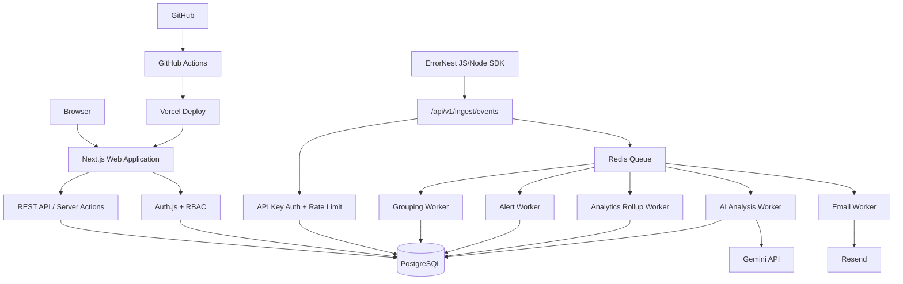
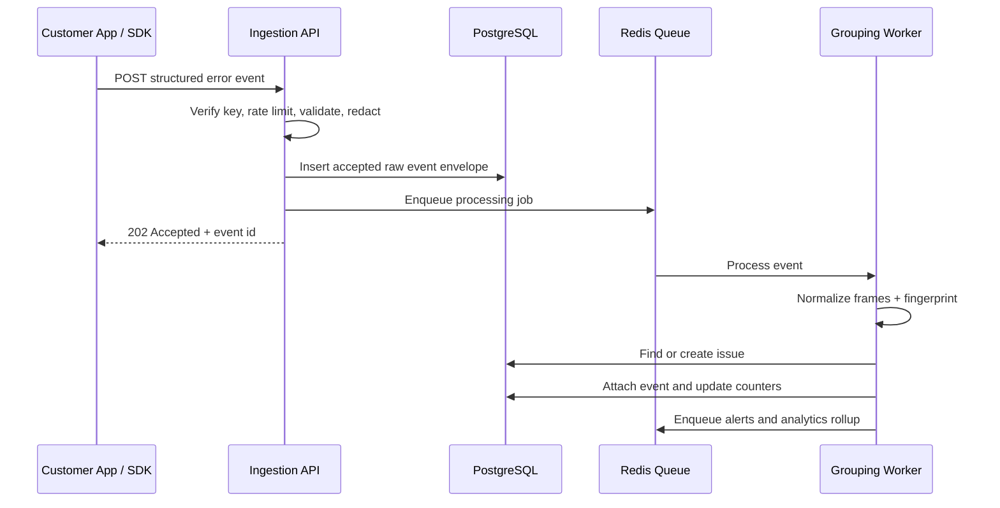
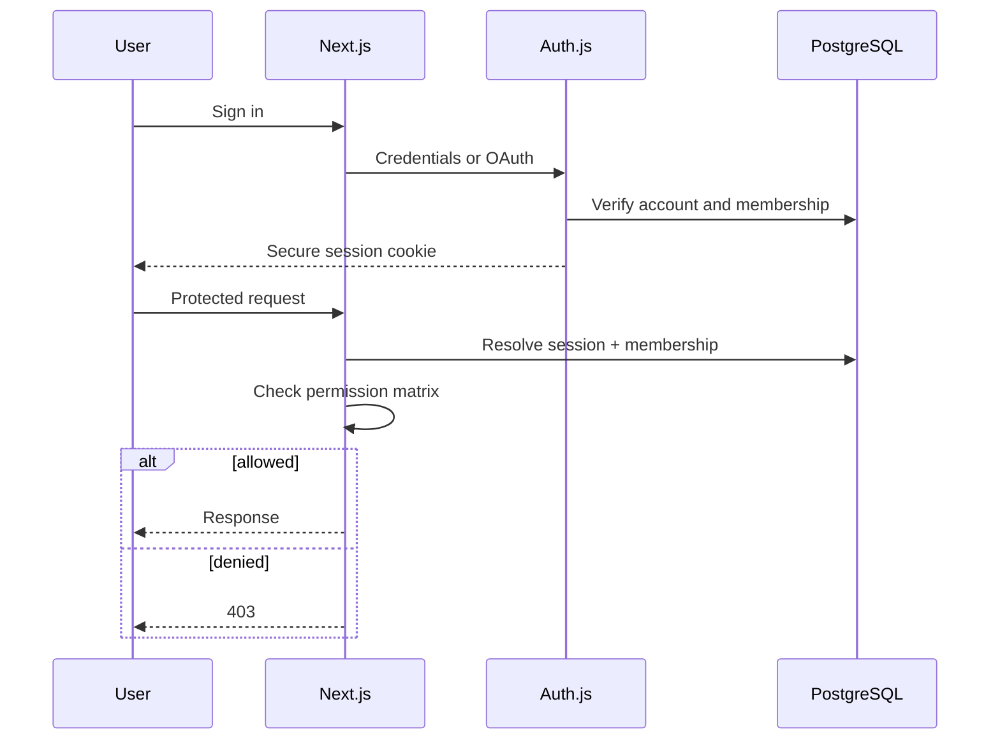
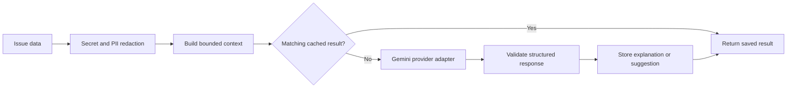
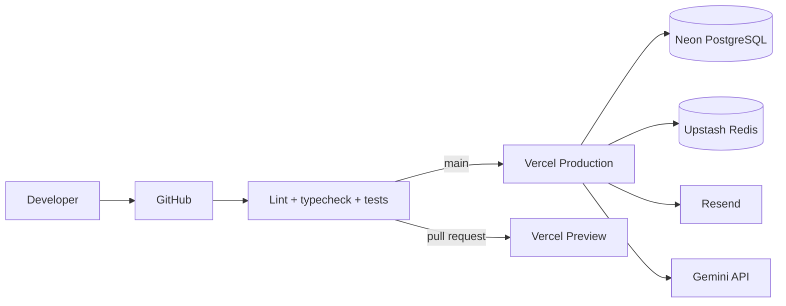

# ErrorNest — Architecture Document

> Source of truth: `plan.md`  
> Status: Approved architecture baseline for implementation

## 1. Architecture Summary

ErrorNest is a multi-tenant, API-first SaaS built as a modular monolith with an asynchronous event-processing pipeline.

The system has six logical layers:

1. **Web client** — marketing pages, authentication, dashboards, issue triage, settings.
2. **Application/API layer** — authenticated REST endpoints and server actions.
3. **Ingestion layer** — high-throughput endpoint authenticated with project API keys.
4. **Worker layer** — grouping, alert evaluation, analytics rollups, email delivery, and AI jobs.
5. **Data layer** — PostgreSQL for structured data and Redis for queues/rate limiting.
6. **External services** — OAuth, transactional email, AI provider, and Vercel hosting.

A modular monolith is preferred over microservices because the 7–14 day timebox rewards a polished, reliable product more than distributed-system complexity. Module boundaries remain explicit so ingestion or AI workers can be split later.

## 2. Locked Technology Stack

| Layer               | Choice                                        |
| ------------------- | --------------------------------------------- |
| Framework           | Next.js App Router                            |
| Language            | TypeScript strict mode                        |
| UI                  | React, Tailwind CSS, shadcn/ui, Lucide        |
| Database            | PostgreSQL on Neon                            |
| ORM                 | Prisma                                        |
| Authentication      | Auth.js                                       |
| Validation          | Zod                                           |
| Forms               | React Hook Form                               |
| Server state        | TanStack Query where client caching is needed |
| Queue / rate limits | Upstash Redis                                 |
| Email               | Resend                                        |
| AI                  | Gemini API behind a provider interface        |
| Charts              | Recharts                                      |
| Testing             | Vitest and Playwright                         |
| Hosting             | Vercel                                        |
| CI                  | GitHub Actions                                |

## 3. High-Level Architecture



## 4. Core Module Boundaries

| Module         | Owns                                                      | Depends on                    |
| -------------- | --------------------------------------------------------- | ----------------------------- |
| Authentication | Users, sessions, OAuth identities, verification/reset     | Database, email               |
| Organizations  | Tenants, memberships, invitations, RBAC                   | Authentication                |
| Projects       | Projects, environments, releases                          | Organizations                 |
| API Keys       | Key creation, hashing, rotation, revocation               | Projects, audit               |
| Ingestion      | Payload validation, idempotency, event acceptance         | API keys, queue               |
| Grouping       | Fingerprinting, issue create/update, regression detection | Events, issues                |
| Issues         | Search, filters, status, assignment, comments             | Projects, memberships         |
| Alerts         | Rules, cooldowns, delivery decisions                      | Grouping, notifications       |
| Notifications  | In-app feed and email jobs                                | Alerts, assignments, mentions |
| Analytics      | Rollups and dashboard queries                             | Events, issues                |
| AI             | Redaction, explanation, fix suggestions, caching          | Issues, external AI           |
| Audit          | Immutable sensitive-action records                        | Every mutating module         |

No route handler may contain core grouping, AI, or permission logic inline. It must call the owning service.

## 5. Request Types

### User-facing requests

Authenticated with an httpOnly session cookie. Each request resolves:

- user identity,
- active organization,
- membership role,
- requested project ownership.

### SDK ingestion requests

Authenticated with a project API key sent in an authorization header. Keys are stored only as hashes. Ingestion never uses user sessions.

## 6. Error Ingestion Pipeline



### Ingestion guarantees

- Payload limit: 200 KB.
- API response target: under 300 ms before network latency.
- Server receipt time is authoritative.
- Optional idempotency key prevents duplicate SDK retries.
- Raw event payload is retained in sanitized JSON form.
- Failed processing jobs retry with exponential backoff and end in a dead-letter state.

## 7. Fingerprinting Strategy

Fingerprint input:

1. error type,
2. normalized error message pattern,
3. first five in-app stack frames,
4. normalized file paths and function names,
5. project id.

Volatile values such as IDs, UUIDs, timestamps, numbers, and query strings are normalized before hashing.

Fallback for missing/minified traces:

- error type,
- normalized message,
- route or transaction name,
- environment.

Manual merge and split operations are preserved as explicit user decisions and logged.

## 8. Authentication and RBAC



Roles:

- **Owner:** full control and organization deletion.
- **Admin:** members, projects, keys, and settings.
- **Member:** triage issues, comments, assignments, and alerts.
- **Viewer:** read-only.

Authorization is enforced server-side for every mutation. Client-side hiding is only a usability layer.

## 9. Database Architecture

PostgreSQL is the system of record.

Key integrity rules:

- every tenant-owned row is reachable from `organization_id`,
- every project resource is checked against the caller's membership,
- soft-deleted rows are excluded through shared query helpers,
- audit entries are append-only,
- issue counter updates and event attachment happen transactionally,
- key rotation revokes the old key and creates the new key atomically.

Analytics uses hourly rollup rows for high-volume charts instead of scanning all events.

## 10. State Management

- Server Components fetch initial authenticated data.
- TanStack Query manages interactive client-side lists and mutations.
- Search/filter/sort state lives in the URL.
- Local state is used only for dialogs, selected rows, expanded frames, and sidebar state.
- Optimistic updates are limited to reversible actions such as marking notifications read.
- Status changes, deletion, key rotation, and AI generation use explicit pending states.

## 11. AI Architecture



Rules:

- AI is never part of ingestion.
- The core tracker works when AI is unavailable.
- Inputs are scrubbed for tokens, passwords, emails, authorization headers, and common secrets.
- Outputs are labeled as AI-generated and never auto-applied.
- Results are cached by an input fingerprint.
- Generation is rate-limited per user and issue.

## 12. Alert Engine

Alert types:

- new issue,
- regression,
- spike.

Spike alerts use a sliding window and a per-rule cooldown. Alert evaluation runs asynchronously after event grouping. In-app notification creation succeeds independently of email delivery.

## 13. Security Architecture

- Argon2id or bcrypt cost 12+ for passwords.
- httpOnly, Secure, SameSite=Lax cookies.
- CSRF protection for state-changing browser requests.
- API keys shown once and stored hashed.
- Rate limits on auth, ingestion, AI, exports, and key operations.
- Zod validation at every boundary.
- Parameterized ORM queries only.
- CSP, HSTS, X-Content-Type-Options, and Referrer-Policy headers.
- User-provided text rendered through framework escaping.
- Secrets only in environment variables.
- Cross-tenant IDs return 404 rather than revealing resource existence.

## 14. Error Handling

API error envelope:

```text
{
  code,
  message,
  fieldErrors?,
  requestId
}
```

Categories:

- 400/422 validation,
- 401 unauthenticated or invalid key,
- 403 insufficient permission,
- 404 not found or cross-tenant,
- 409 state conflict,
- 413 payload too large,
- 429 rate limited with Retry-After,
- 500 internal error,
- 502 upstream AI/email failure.

Every async page has loading, empty, error, and success states.

## 15. Observability and Logs

- Structured operational logs with request ID, route, latency, status, and tenant/project IDs.
- Worker logs with job ID, attempt, duration, and failure reason.
- Immutable product audit log for security-sensitive business actions.
- No passwords, full API keys, cookies, or raw authorization headers in logs.

## 16. Deployment



Migrations are committed and executed explicitly during deployment. Preview environments use separate database branches when available.

## 17. Environment Variables

| Variable                       | Purpose                     |
| ------------------------------ | --------------------------- |
| DATABASE_URL                   | PostgreSQL connection       |
| AUTH_SECRET                    | Session signing secret      |
| AUTH_GOOGLE_ID / SECRET        | Google OAuth                |
| AUTH_GITHUB_ID / SECRET        | GitHub OAuth                |
| RESEND_API_KEY                 | Transactional email         |
| EMAIL_FROM                     | Sender identity             |
| UPSTASH_REDIS_REST_URL / TOKEN | Queue and rate limits       |
| GEMINI_API_KEY                 | AI analysis                 |
| APP_URL                        | Canonical application URL   |
| INGESTION_MAX_BYTES            | Payload cap                 |
| AI_DAILY_LIMIT                 | AI cost limit               |
| CRON_SECRET                    | Protected scheduled workers |

## 18. Scalability Path

1. Partition or retain events by age.
2. Move ingestion to a dedicated service if request volume requires it.
3. Use a managed queue with separate worker autoscaling.
4. Add daily/hourly analytics aggregates.
5. Add object storage for large source maps and attachments.
6. Introduce ClickHouse only when PostgreSQL event analytics becomes a measured bottleneck.

## 19. Key Trade-offs

- **Modular monolith over microservices:** faster delivery, simpler deployment, adequate for MVP.
- **Deterministic grouping over AI grouping:** predictable, testable, low cost.
- **PostgreSQL search over Elasticsearch:** sufficient for MVP and reduces infrastructure.
- **Async alerts and AI:** keeps ingestion reliable and fast.
- **JS/Node SDK only:** proves the pipeline without spreading effort across languages.
