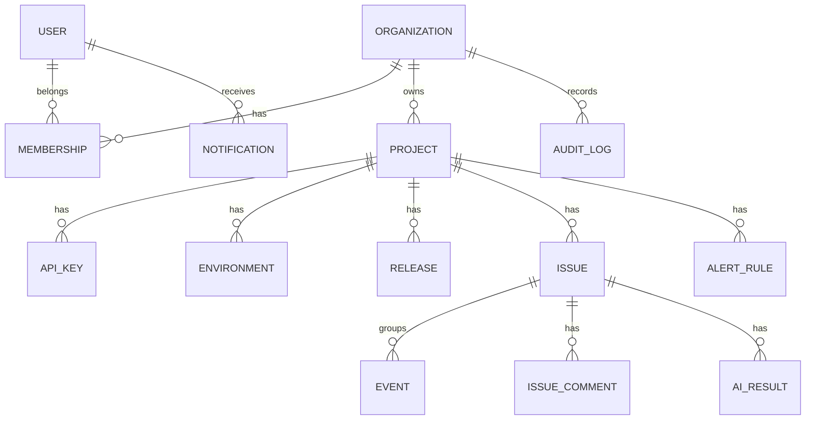

# ErrorNest — Database Schema Specification

> This document converts `plan.md` into an implementation-ready relational data model.  
> ORM target: Prisma. Database target: PostgreSQL.

## 1. Modeling Principles

- All primary keys use UUID/CUID-style server-generated IDs.
- Every mutable table has `created_at` and `updated_at`.
- Tenant-owned records are scoped directly or transitively to an organization.
- Soft deletion is used where recovery and auditability matter.
- API keys and session tokens are stored only as hashes.
- High-volume event data is separated from issue summary data.
- Audit logs are append-only.
- JSON is used only for genuinely flexible payloads, not as a substitute for relationships.

## 2. Enums

### MembershipRole

`OWNER | ADMIN | MEMBER | VIEWER`

### MembershipStatus

`INVITED | ACTIVE | REMOVED`

### ProjectStatus

`ACTIVE | ARCHIVED`

### IssueStatus

`UNRESOLVED | RESOLVED | REOPENED | IGNORED`

### EventLevel

`FATAL | ERROR | WARNING | INFO`

### AlertType

`NEW_ISSUE | REGRESSION | SPIKE`

### NotificationType

`ALERT | ASSIGNMENT | MENTION | SYSTEM`

### AiResultType

`EXPLANATION | FIX_SUGGESTION`

### AiFeedback

`HELPFUL | NOT_HELPFUL`

## 3. Tables

### users

- id
- email, unique
- password_hash, nullable for OAuth-only users
- display_name
- avatar_url, nullable
- email_verified_at, nullable
- created_at
- updated_at
- deleted_at, nullable

Indexes: unique email; deleted_at.

### oauth_accounts

- id
- user_id
- provider
- provider_account_id
- created_at

Constraints: unique(provider, provider_account_id).

### sessions

- id
- user_id
- token_hash, unique
- expires_at
- revoked_at, nullable
- ip_address, nullable
- user_agent, nullable
- created_at

Indexes: user_id, token_hash, expires_at.

### verification_tokens

- id
- user_id
- token_hash, unique
- type
- expires_at
- used_at, nullable
- created_at

### organizations

- id
- name
- slug, unique
- created_at
- updated_at
- deleted_at, nullable

### memberships

- id
- organization_id
- user_id
- role
- status
- invited_by_user_id, nullable
- joined_at, nullable
- created_at
- updated_at

Constraints: unique(organization_id, user_id).  
Indexes: user_id; organization_id + role.

### invites

- id
- organization_id
- email
- role
- token_hash, unique
- invited_by_user_id
- expires_at
- accepted_at, nullable
- revoked_at, nullable
- created_at

Indexes: organization_id + email; expires_at.

### projects

- id
- organization_id
- name
- slug
- platform
- status
- created_at
- updated_at
- deleted_at, nullable

Constraints: unique(organization_id, slug), unique(organization_id, name).

### api_keys

- id
- project_id
- name
- key_hash, unique
- key_prefix
- key_suffix
- created_by_user_id
- last_used_at, nullable
- revoked_at, nullable
- created_at

Indexes: project_id; key_hash.

### environments

- id
- project_id
- name
- is_hidden
- created_at
- updated_at

Constraints: unique(project_id, name).

### releases

- id
- project_id
- version
- commit_sha, nullable
- deployed_at, nullable
- created_by_user_id, nullable
- created_at

Constraints: unique(project_id, version).

### issues

- id
- project_id
- fingerprint
- title
- error_type
- normalized_message
- status
- level
- first_seen_at
- last_seen_at
- occurrence_count
- affected_user_count
- assignee_user_id, nullable
- resolved_by_user_id, nullable
- resolved_at, nullable
- grouping_confidence
- created_at
- updated_at
- deleted_at, nullable

Indexes:

- project_id + fingerprint
- project_id + status + last_seen_at
- project_id + level + last_seen_at
- assignee_user_id + status
- trigram/full-text index on title and normalized_message

### events

- id
- project_id
- issue_id, nullable until processed
- environment_id
- release_id, nullable
- idempotency_key, nullable
- message
- error_type
- level
- raw_stack_trace
- normalized_frames, JSON
- user_external_id, nullable
- user_context, JSON nullable
- tags, JSON
- raw_payload, JSON
- payload_truncated
- client_sent_at, nullable
- server_received_at
- processed_at, nullable
- processing_error, nullable
- created_at

Constraints: unique(project_id, idempotency_key) when idempotency_key is present.

Indexes:

- issue_id + server_received_at
- project_id + server_received_at
- project_id + environment_id + server_received_at
- project_id + release_id + server_received_at

### issue_comments

- id
- issue_id
- author_user_id
- body
- created_at
- updated_at
- deleted_at, nullable

### comment_mentions

- comment_id
- mentioned_user_id

Constraints: unique(comment_id, mentioned_user_id).

### issue_activity

- id
- issue_id
- actor_user_id, nullable
- type
- metadata, JSON
- created_at

Indexes: issue_id + created_at.

### alert_rules

- id
- project_id
- name
- type
- environment_id, nullable
- minimum_level, nullable
- threshold_count, nullable
- threshold_window_seconds, nullable
- cooldown_seconds
- is_active
- last_triggered_at, nullable
- created_by_user_id
- created_at
- updated_at

Indexes: project_id + is_active + type.

### alert_occurrences

- id
- alert_rule_id
- issue_id, nullable
- window_started_at
- triggered_at
- deduplication_key
- created_at

Constraints: unique(alert_rule_id, deduplication_key).

### notifications

- id
- user_id
- organization_id
- type
- title
- body
- target_url
- payload, JSON
- read_at, nullable
- created_at

Indexes: user_id + read_at + created_at.

### notification_preferences

- id
- user_id
- type
- in_app_enabled
- email_enabled
- updated_at

Constraints: unique(user_id, type).

### ai_results

- id
- issue_id
- type
- input_fingerprint
- model
- content, JSON/text
- requested_by_user_id
- feedback, nullable
- created_at

Constraints: unique(issue_id, type, input_fingerprint).

### audit_logs

- id
- organization_id
- actor_user_id, nullable
- actor_name_snapshot
- actor_email_snapshot
- action_type
- target_type
- target_id
- before_state, JSON nullable
- after_state, JSON nullable
- ip_address, nullable
- request_id, nullable
- created_at

Indexes:

- organization_id + created_at
- target_type + target_id + created_at
- actor_user_id + created_at

No update or delete operation may be exposed for this table.

### analytics_hourly

- id
- project_id
- environment_id, nullable
- release_id, nullable
- bucket_start
- event_count
- new_issue_count
- reopened_issue_count
- affected_user_count
- created_at
- updated_at

Constraints: unique(project_id, environment_id, release_id, bucket_start).

## 4. Relationship Diagram

## 5. Transaction Boundaries

The following operations must be transactional:

- organization creation + owner membership,
- project creation + default API key,
- key rotation,
- issue resolution + activity + audit,
- role change + session invalidation + audit,
- event grouping + issue counters,
- issue merge/split,
- project deletion + alert rule deactivation,
- organization deletion cascade.

## 6. Retention and Cleanup

MVP defaults:

- raw events retained for 30 days,
- issues retained until project deletion,
- audit logs retained indefinitely,
- expired sessions/tokens cleaned daily,
- revoked API keys retained for audit,
- soft-deleted projects recoverable for 14 days.

## 7. Seed Data

Seed:

- one demo organization,
- one Owner demo account,
- two projects,
- production/staging environments,
- three releases,
- 15–25 issues,
- 200+ events,
- alert rules,
- notifications,
- sample AI explanations.

The README should provide read-only demo credentials.
